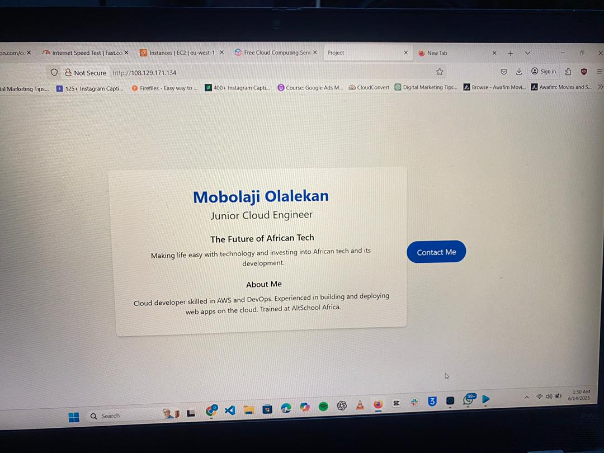

# AltSchool Cloud Project - Second Semester

## Project Title
*The Future of [Your Startup Idea]*

## Hosted on
*Public IP:* http://YOUR_PUBLIC_IP

## Team Member
- *Name:* Olalekan Mobolaji
- *Role:* Lead Cloud Engineer

## Project Pitch
This project is a prototype web application that showcases our cloud engineering and web development skills. It is designed to demonstrate a production-ready deployment on a cloud server using modern tools and best practices.

## Features
- Ubuntu Server on AWS EC2
- Nginx Web Server
- Tailwind CSS (Optional)
- HTML Landing Page with Personal Bio & Project Pitch

## Screenshot

## How It Was Built
1. *Provisioned* Ubuntu EC2 instance via AWS
2. *Installed* and configured Nginx
3. *Deployed* a custom HTML landing page
4. (Optional) *Styled* with Tailwind CSS
5. Configured Security Group rules for HTTP (80) and HTTPS (443)

---

### Note:
This project demonstrates how to deploy a professional web page using modern cloud infrastructure.